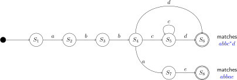
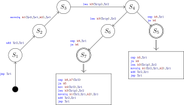

# Algorithm

This page describes how the algorithm is able to match x86
patterns for indirect jumps.

## Pattern Matching

Matching a regular expression is efficient because it is only
a matter of following a state machine. The following figure
shows a simple state machine that can match patterns `abbc*d`
and `abbac`.



We use a similar method to match instruction patterns for
indirect jump. Rather than having character as state machine
input, we use instructions as input. The following figure
shows a state machine that can match two indirect jump
patterns.



_Note: while we use "state machine" here, the code base uses
"tree" and "pattern" for describing this concept._

## Placeholders

Since patterns must be register and value agnostic, both are
replaced with placeholders. For example,the instruction `mov
$10,%rbx` may be treated as `mov $k1,%r1`. Placeholders are
allocated incrementally.

When a register has been matched, any subsequent encounter of
this register is replaced by the same placeholder. A value is
always replaced a new placeholder.

## Watch List & Actions

Pattern for an indirect jump may be interleaved with other
instructions that aren't involved in it. These instructions
must be ignored while matching.

In order to filter instructions, a watch list is used. The list has 2 kind of rules. It can filter instructions based
on the instruction's opcode and also on which register are
written by it.

The rules of the watch list are updated by _actions_ in each
state after a succesful match (or state transition). For
example, the first node would add register `%r1` to the watch
list because the pattern needs to know other instructions
that write to it.

# Example Pattern

The following assembly code shows the computation of an
indirect jump based on a 6-way jump table.

```
cmp    $5,%ebx
ja     10
lea    100(%rip),%rsi
movslq (%rsi,%rbx,4),%rbx
add    %rsi,%rbx
jmpq   *%rbx
```

In our pattern tree, we can describe the general pattern
of this case using the following pseudo-assembly code.

```
cmp    $k5,%r1d
ja     k4
lea    k3(%rip),%r2
movslq k1(%r2,%r1,k2),%r1
add    %r2,%r1
jmpq   *%r1
```

The first register in this pattern is `%rbx`. Every encounter
of this register is replaced by `%r1`. The 32-bit register
`%ebx` is replaced by `%r1d`. The second and last encountered
register in this pattern is `%rsi` and it is replaced by
`%r2`. Every constant values are replaced by `k1`, `k2`,
`k3`, `k4` and `k5` in the order of appearance.

By carefully analysing the computation that are being done,
we can find that the jump address is given by the following
expression (brackets mean memory access is done).

```
[k1 + (k3 + rip[0]) + i * k2] + (k3 + rip[0])
    where i from 0 to k5 inclusive
```

Notice that there is this `rip[0]` constant. Each time the
`%rip` register is matched, it is pushed on a list. The value
is always known since it points to the next instruction. Some
pattern may use `%rip` multiple times, thus it is possible
that `rip[1]`, `rip[2]` or other may be used.

The pattern can be described in this library using the
following syntax (instructions are in reverse order).

```
jmp(reg(R1), {TRACK_R1}),
add(reg(R2), reg(R1), {TRACK_R2}),
movslq(mem4(K1, R2, R1, K2), reg(R1), {}),
lea(mem2(K3, RIP), reg(R2), {IGNORE_R2, TRACK_INS_JA}),
ja(imm(K4), {TRACK_INS_CMP, IGNORE_INS_JA}),
cmp(imm(K5), reg(R1D), {IGNORE_INS_CMP}),
```

Writting a new pattern is almost a copy of the original
pseudo-assembly given earlier. The additional information
that must be provided are the actions that should be executed
on a given node.

# Example Match

Let's assume we have the following instructions to match
the pattern defined in the last section. Addresses on the
left are example values not computed by instructions length.

```
00   cmp    $7,%eax
04   ja     14
08   lea    452(%rip),%rdx
0d   movslq 154(%rdx,%rax,4),%rax
11   mov    %edi,%edi
16   add    %rdx,%rax
1a   push   %rax
1f   jmpq   *%rax
```

1. `jmpq *%rax` is matched as `jmpq *%r1`
    * `%r1` is allocated as `%rax` and added to the watch list
    * watch list: `%rax`
2. `push %rax` is ignored by the watch list.
3. `add %rdx,%rax` is matched as `add %r2,%r1`
    * `%r2` is allocated as `%rdx` and added to the watch list
    * watch list: `%rax` `%rdx`
4. `mov %edi,%edi` is ignored by the watch list.
5. `movslq 154(%rdx,%rax,4),%rax` is matched as `movslq k1(%r2,%r1,k2),%r1`
    * `%k1` is allocated as `154`
    * `%k2` is allocated as `4`
    * watch list: `%rax` `%rdx`
6. `lea 452(%rip),%rdx` is matched as `lea  k3(%rip),%r2`
    * `%k3` is allocated as `452`
    * `%rdx` is removed from the watch list
    * `ja` instruction is added to the watch list
    * watch list: `%rax` `ja`
7. `ja 14` is matched as `ja k4`
    * `%k4` is allocated as `14`
    * `ja` instruction is removed to the watch list
    * `cmp` instruction is added to the watch list
    * watch list: `%rax` `cmp`
8. `cmp $7,%eax` is matched as `cmp $k5,%r1d`
    * `%k5` is allocated as `7`
    * `cmp` instruction is removed to the watch list
    * `%rax` is removed from the watch list
    * watch list:

With all values allocated, the jump targets would be computed
by the following formula (we assume that the `i`-th memory
access returns `i * 10`).

```
  [154 + (452 + 13) + i * 4] + (452 + 13)
      where i from 0 to 7 inclusive
= [619 + i * 4] + 465
      where i from 0 to 7 inclusive
= {465, 475, 485, 495, 505, 515, 525, 535}
```